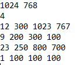
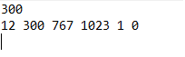

# Fall 2021 CS 3353 PA 01 - Kian Rahimi

Being part of a consulting firm, the goal of this project is to help art galleries 
determine the best way to place their art on a given wall size in order to generate the 
highest revenue. In order to determine this, the wall size as well as the number of 
paintings (and their descriptions) are provided to achieve the highest revenue possible.

The information provided within the input files (in order) are:
1. Wall Dimensions (length and height)
2. Number of Paintings
3. The dimensions of each painting

    a. Picture ID
    
    b. Value of the picture
   
    c. width of the picture
   
    d. Height of the picture
   
With this provided information, the objective of our program is to try three different 
methods of taking in the data in order to find the best possible outcome (highest revenue).
The three methods are Brute Force, Most Expensive, and Shortest to Tallest. By putting
in one input file that holds information listed above, the program will output three files 
of its own, each of them representing a specific method.

The following is an example of an input file:

The following is an example of an output file:

In theory, this program performs a "Shelf Next Fit" algorithm. This means that the program
will treat the wall and artwork as "shelves." For example, beginning with the bottom left
corner of the wall, the program will go right and take turns palcing artwork on the wall. 
In the meantime, the height of the tallest piece of art will be stored for later.

Because there is limited space, in the  case that the artwork being placed does not fit
within that row, the program will go up to the top of the highest piece of art on that row,
and place a "shelf" on top.That way, the program can start above that art and back on the
left, in which it will go through the same motion again. This method is practiced amongst
the three methods.

The point of the Brute Force method is to achieve the most optimal solution. In this case, 
the optimal outcome would mean to find the solution with the highest revenue.

Moving on to the Most Expensive method, the point of this method is to consider the data
based on the revenue. For this reason, the program will take account of the pictures
by value in decreasing order, thus performing its method on the wall.

Finally, the last method this program takes account of is searching from shortest to tallest.
The data will be sorted based on the height of the picture, and from there, try to place
as many pictures on the wall as possible.
